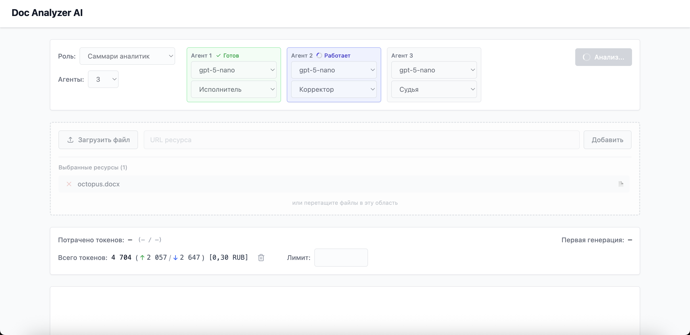
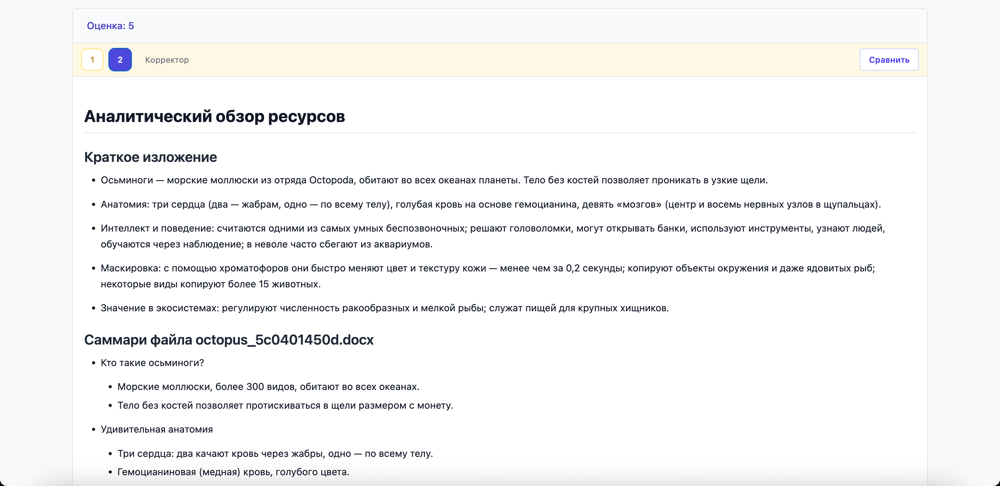
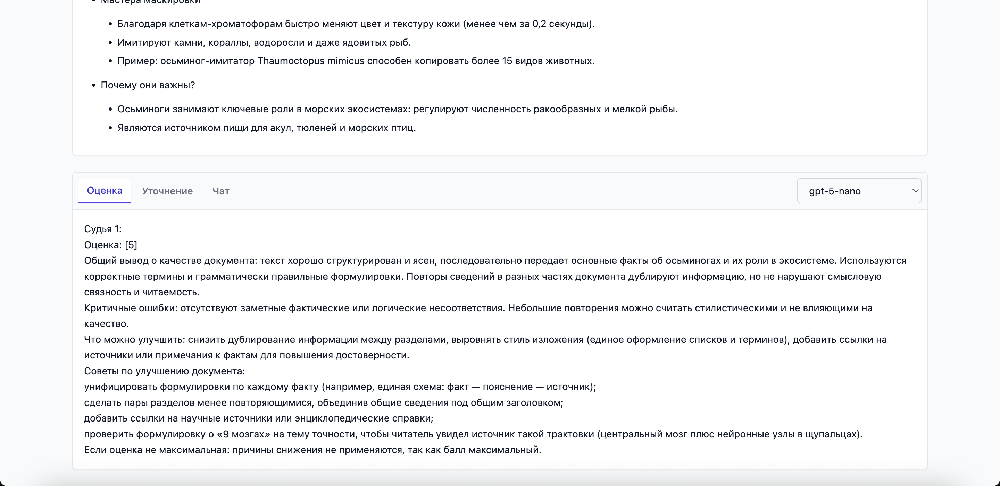

# AI Documents Analyzer

Монорепозиторий платформы для анализа документов с помощью AI-агентов.
Система состоит из backend-сервиса на FastAPI и frontend-приложения на React, поддерживает загрузку файлов и URL, мультиагентный анализ, SSE-стриминг, учет токенов и стоимости.

## Содержание
- [Состав проекта](#состав-проекта)
- [Основные возможности](#основные-возможности)
- [Технологический стек](#технологический-стек)
- [Быстрый старт (Docker)](#быстрый-старт-docker)
- [Полезные команды Make](#полезные-команды-make)
- [Локальный запуск (без Docker)](#локальный-запуск-без-docker)
- [Автотесты](#автотесты)
- [Структура репозитория](#структура-репозитория)
- [API](#api)
- [Поддерживаемые форматы файлов](#поддерживаемые-форматы-файлов)
- [Примечания по эксплуатации](#примечания-по-эксплуатации)

_Анализ документа с коррекцией и оценкой результата_

_Запуск AI-агентов:_



_Результат анализа документов:_



_Оценка анализа агентом-судьей:_



## Состав проекта

- [services/doc-analyzer-backend](./services/doc-analyzer-backend/README.md) — API, оркестрация AI-агентов, работа с файлами и URL, RAG, учет токенов и стоимости.
- [services/doc-analyzer-ui](./services/doc-analyzer-ui/README.md) — web-интерфейс для настройки ролей, агентов, запуска анализа и просмотра результатов.
- `shared/*` — общие Python-пакеты:
  - `agent-enums`
  - `db-repository`
  - `rag-client`
- `infrastructure/*` — инфраструктурные конфиги:
  - `postgres/init` (SQL-инициализация)
  - `pgadmin` (конфиги подключения)
  - `observability` (Loki/Promtail/Grafana)

## Основные возможности

- Загрузка файлов через UI (drag-and-drop и выбор с диска).
- Получение данных из URL-источников.
- Анализ документов в различных режимах (`/doc/analyze`, `/doc/analyze/stream`):
  - одиночный AI-агент,
  - совет AI-агентов (несколько агентов с разными назначениями).
- Выбор роли, количества агентов и их назначения, LLM-модели.
- Потоковая выдача анализа и чата через SSE.
- Уточнение ответа (`/doc/clarify`) и чат с агентом (`/doc/chat`, `/doc/chat/stream`).
- История ответов и сравнение итераций в UI.
- Отображение токенов, стоимости и очистка накопленной статистики.

## Технологический стек

**Backend**
- Python 3.14
- FastAPI, Uvicorn
- LangChain, LangGraph
- OpenAI / Ollama (через конфиг провайдеров)
- SQLAlchemy, PostgreSQL
- ChromaDB (RAG)
- PyMuPDF, pypdf, pdfplumber, python-docx, python-pptx, openpyxl, unstructured
- Tesseract OCR, OpenCV, Pillow

**Frontend**
- React 19 + Vite
- Tailwind CSS 4
- Nginx (runtime + reverse proxy `/api/*` -> backend)

**Инфраструктура**
- Docker Compose (profiles: `core`, `admin`, `observability`, `all`)
- PostgreSQL, ChromaDB, pgAdmin, Loki, Promtail, Grafana

## Быстрый старт (Docker)

### Требования

- Docker + Docker Compose (plugin)

### Подготовка окружения

В проекте используется файл `.env` в корне репозитория.
Убедитесь, что в нем заданы корректные значения.
Используйте `.env.example` в качестве шаблона настроек.

### Запуск основных сервисов

Запускает `Frontend`, `Backend`, `Postgres`, `ChromaDB`.

```bash
make up
```

После запуска доступны:

- Frontend: `http://localhost`
- Backend API: `http://localhost:8000`
- Swagger: `http://localhost:8000/docs`
- ReDoc: `http://localhost:8000/redoc`
- ChromaDB: `http://localhost:8001`

### Запуск observability инструментов

Запускает `Loki`, `Promtail`, `Grafana`.

```bash
make up-observability
```

После запуска доступны:

- Grafana: `http://localhost:3000`

### Запуск инструментов администрирования

Запускает `pgAdmin`.

```bash
make up-admin
```

После запуска доступны:

- pgAdmin: `http://localhost:5050`

### Запуск всех сервисов

Запускает основные сервисы, observability инстурменты и инструменты администрирования

```bash
make up-all
```

## Полезные команды Make

```bash
make help
make up
make up-all
make dev
make down
make logs
make ps
make test
make test-coverage
make lint
make format
```

## Локальный запуск (без Docker)

### Backend

```bash
# из корня репозитория
pip install -e shared/agent-enums
pip install -e shared/db-repository
pip install -e shared/rag-client
pip install -r services/doc-analyzer-backend/requirements.txt

# запуск backend
cd services/doc-analyzer-backend
python -m src.doc_analyzer_backend.main
```

### Frontend

```bash
cd services/doc-analyzer-ui
npm ci
npm run dev
```

Vite dev server проксирует `/api` на `http://localhost:8000`.

## Автотесты

### Покрытие

- Backend-тесты в `services/doc-analyzer-backend/tests`.
- Основной фокус — unit/API-тесты для endpoint-ов анализа документов, загрузки файлов и данных URL, превью файлов и URL, запросы health и status и т.д.

### Запуск через Make (из корня репозитория)

```bash
make test
make test-coverage
```

- `make test` — запускает backend-тесты (`pytest tests/ -v`).
- `make test-coverage` — запускает тесты с покрытием (HTML-отчет в `services/doc-analyzer-backend/htmlcov`).

### Прямой запуск pytest

```bash
cd services/doc-analyzer-backend
pytest tests/ -v
```

Запуск отдельного теста:

```bash
cd services/doc-analyzer-backend
pytest tests/unit/test_api_health_check.py -v
```

### Allure-отчеты

Настройки `pytest.ini`:

- `--alluredir=./allure-results`
- `--clean-alluredir`

После прогона тестов результаты находятся в `services/doc-analyzer-backend/allure-results`.
Если установлен Allure CLI, отчет можно открыть так:

```bash
cd services/doc-analyzer-backend
allure serve allure-results
```

### Тесты shared-пакетов

В `Makefile` есть команда:

```bash
make test-packages
```

Она запускает `pytest` по пакетам в `shared/*`.

## Структура репозитория

```text
doc-analyzer-ai-agent/
├── docker-compose.yml                          # Оркестрация сервисов и профилей
├── Makefile                                    # Команды запуска, тестов, линтинга, сборки
├── .env                                        # Переменные окружения
├── README.md
│
├── services/
│   ├── doc-analyzer-backend/                   # FastAPI backend
│   │   ├── Dockerfile                          # Multi-stage build
│   │   ├── requirements.txt
│   │   ├── AGENT.md
│   │   ├── src/
│   │   │   └── doc_analyzer_backend/
│   │   │       ├── main.py                     # Точка входа (uvicorn)
│   │   │       │                               
│   │   │       ├── api/                        # HTTP-слой
│   │   │       │   ├── api.py                  # Инициализация FastAPI, lifespan, middleware
│   │   │       │   ├── routers/                # Группы endpoint'ов
│   │   │       │   ├── models/                 # Pydantic request/response модели
│   │   │       │   ├── dependencies/           # DI-функции (agent, council, app_state, session)
│   │   │       │   ├── exceptions/             # Кастомные исключения и обработчики
│   │   │       │   └── utils/                  # SSE-утилиты, сборка API-ответов
│   │   │       │                               
│   │   │       ├── agent/                      # Ядро LLM-логики
│   │   │       │   ├── agent.py                # Основной агент
│   │   │       │   ├── core/                   # Граф выполнения и менеджмент моделей
│   │   │       │   ├── context/                # Хранилища промптов/диалогов/RAG-контекста
│   │   │       │   ├── agent_ai_invocation/    # Сценарии вызовов LLM
│   │   │       │   ├── council/                # Мультиагентный режим
│   │   │       │   ├── runners/                # Оркестрация стадий/очередей
│   │   │       │   ├── models/                 # Внутренние DTO для анализа/токенов/назначений
│   │   │       │   ├── messages_data/          # Формирование сообщений и progress-событий
│   │   │       │   └── consumption_counters/   # Подсчет токенов и стоимости
│   │   │       │
│   │   │       ├── components/                 # Работа с источниками данных
│   │   │       │   ├── uploader/               # Прием файлов и контента по URL
│   │   │       │   ├── preview_reader/         # Предпросмотр и разбор содержимого
│   │   │       │   └── file_manager/           # Листинг, сортировка, пагинация
│   │   │       │
│   │   │       ├── tools/                      # Инструменты агента
│   │   │       ├── llm/                        # Фабрика LLM-провайдеров и mock
│   │   │       ├── config/                     # Конфиги приложения
│   │   │       ├── data/                       # AppState и aggregate-утилиты
│   │   │       ├── session/                    # Управление пользовательской сессией
│   │   │       ├── decorators/                 # Вспомогательные декораторы
│   │   │       ├── utils/                      # Общие утилиты
│   │   │       ├── local_prompts/              # Локальные шаблоны промптов
│   │   │       ├── documents/                  # Runtime-хранилище загруженных документов
│   │   │       └── logs/                       # Runtime-логи backend
│   │   │
│   │   └── tests/                              # Автотесты
│   │       ├── assertions/                     # Кастомные ассерты
│   │       ├── consts/                         # Константы для автотестов
│   │       ├── factories/                      # Фабрики тестовых данных
│   │       ├── fixtures/                       # Фикстуры
│   │       ├── unit/                           # Unit API автотесты
│   │       ├── utils/                          # Тестовые утилиты
│   │       └── conftest.py                     # Подключение фикстур
│   │                                           
│   └── doc-analyzer-ui/                        # React frontend
│       ├── Dockerfile                          # Multi-stage build (node -> nginx)
│       ├── nginx.conf                          # SPA fallback, проксирование API, настройки Cookie, SSE
│       ├── package.json
│       ├── AGENT.md
│       └── src/                                
│           ├── main.jsx                        # Инициализация React
│           ├── index.css                       # Общие стили приложения
│           ├── App.jsx                         # Корневой компонент и orchestration API-вызовов
│           ├── components/                     
│           │   ├── MainMenu.jsx                # Выбор роли/агентов/моделей/назначений
│           │   ├── ResourcesUpload.jsx         # Загрузка файлов и добавление URL
│           │   ├── AnalysisResult.jsx          # Вкладки ответов, markdown-рендер, версии
│           │   ├── JudgementResult.jsx         # Уточнение и чат со стримингом
│           │   └── StatisticsSummary.jsx       # Токены, стоимость, лимиты, время
│           └── utils/
│               └── api.js                      # Работа с API backend
│
├── shared/
│   ├── agent_enums/                            # Role, Assignment, AnswerStatus, PromptType и др.
│   ├── db_repository/                          # PromptRepository и SQLAlchemy-модели                          
│   └── rag_client/                             # ChromaDB client/factory, embedders, config
│
└── infrastructure/
    ├── postgres/
    │   └── init/                               # Скрипт SQL-инициализации
    └── observability/
        ├── loki/                               # Конфигурация Loki
        ├── promtail/                           # Конфигурация Promtail
        ├── grafana/
        │   └── provisioning/
        │       ├── dashboards/                 # Grafana dashboards
        │       └── datasources/                # Grafana datasources
        └── pgadmin/                            # Настройка подключения к серверу Postgres
```

## API

### Системные endpoint'ы

| Метод | Backend endpoint | Через UI/Nginx | Назначение |
|---|---|---|---|
| GET | `/health` | `/health` и `/api/health` | Проверка готовности сервиса |
| GET | `/status` | `/api/status` | Текущая модель, инструменты, состояние RAG |
| GET | `/status/session` | `/api/status/session` | Статус сессии и активных инструментов |
| GET | `/config` | `/api/config` | Конфиг для UI: роли, модели, лимиты |

### Сессия пользователя

| Метод | Backend endpoint | Через UI/Nginx | Назначение |
|---|---|---|---|
| GET | `/sessions/current` | `/api/sessions/current` | Получить текущую сессию |
| DELETE | `/sessions/current` | `/api/sessions/current` | Удалить текущую сессию |

### Источники данных

| Метод | Backend endpoint | Через UI/Nginx | Назначение |
|---|---|---|---|
| POST | `/upload/file` | `/api/upload/file` | Загрузка файла |
| POST | `/upload/from-url` | `/api/upload/from-url` | Загрузка/получение контента по URL |
| GET | `/files/list` | `/api/files/list` | Список файлов (сортировка, фильтры, пагинация) |
| GET | `/files/preview` | `/api/files/preview` | Предпросмотр содержимого файла |

### Анализ документов и чат

| Метод | Backend endpoint | Через UI/Nginx | Назначение |
|---|---|---|---|
| POST | `/doc/analyze` | `/api/doc/analyze` | Анализ документов (JSON-ответ) |
| POST | `/doc/analyze/stream` | `/api/doc/analyze/stream` | Анализ документов со стримингом (SSE) |
| POST | `/doc/clarify` | `/api/doc/clarify` | Уточнение ответа агента |
| POST | `/doc/chat` | `/api/doc/chat` | Нестриминговый чат |
| POST | `/doc/chat/stream` | `/api/doc/chat/stream` | Стриминговый чат (SSE) |
| POST | `/doc/history` | `/api/doc/history` | История взаимодействий |

### Токены и стоимость

| Метод | Backend endpoint | Через UI/Nginx | Назначение |
|---|---|---|---|
| GET | `/tokens/total` | `/api/tokens/total` | Суммарные токены и стоимость |
| POST | `/tokens/clear` | `/api/tokens/clear` | Очистка статистики токенов/стоимости |

## Поддерживаемые форматы файлов

Поддерживаются следующие форматы файлов в качестве источника данных:

`.txt`, `.md`, `.csv`, `.json`, `.yaml`, `.yml`, `.html`, `.xml`, `.docx`, `.xlsx`, `.pptx`, `.pdf`, `.jpg`, `.jpeg`, `.png`, `.gif`, `.tiff`, `.bmp`, `.py`, `.js`, `.ts`, `.java`, `.kt`, `.scala`, `.cs`, `.cpp`, `.go`, `.php`, `.swift`, `.r`, `.pl`, `.sql`, `.sh`, `.zsh`, `.bash`.

## Примечания по эксплуатации

- Для SSE в `services/doc-analyzer-ui/nginx.conf` отключена буферизация (`proxy_buffering off`).
- В backend-образе устанавливаются системные зависимости для OCR и обработки документов (в т.ч. `tesseract-ocr`, `poppler-utils`, `libmagic1`).
- Shared-пакеты из `shared/*` собираются в wheel и устанавливаются в backend-образ на этапе Docker-сборки.
